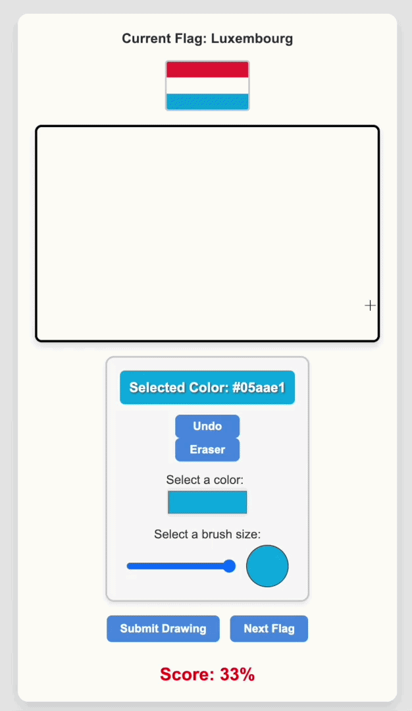

# Country Flag Drawing Game
Interactive React app made through Typescript and Vite where users can replicate country flags on canvas which is then scored on accuracy with a generated score.

# Demo

  

# Features
* Randomly selects flags
* Change color and size of brush
* Eraser and undo for drawing
* Scoring as a percentage based on reference flag list from [Flagpedia](https://flagpedia.net/download)

# Prerequisites
* Node.js v18+
* npm
